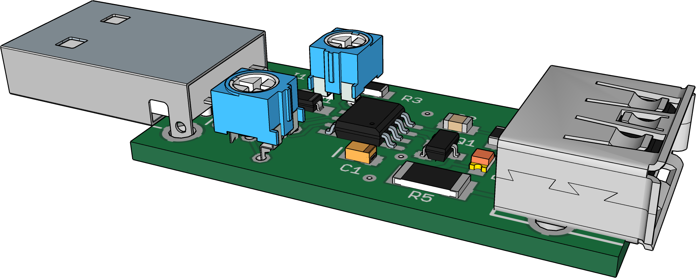
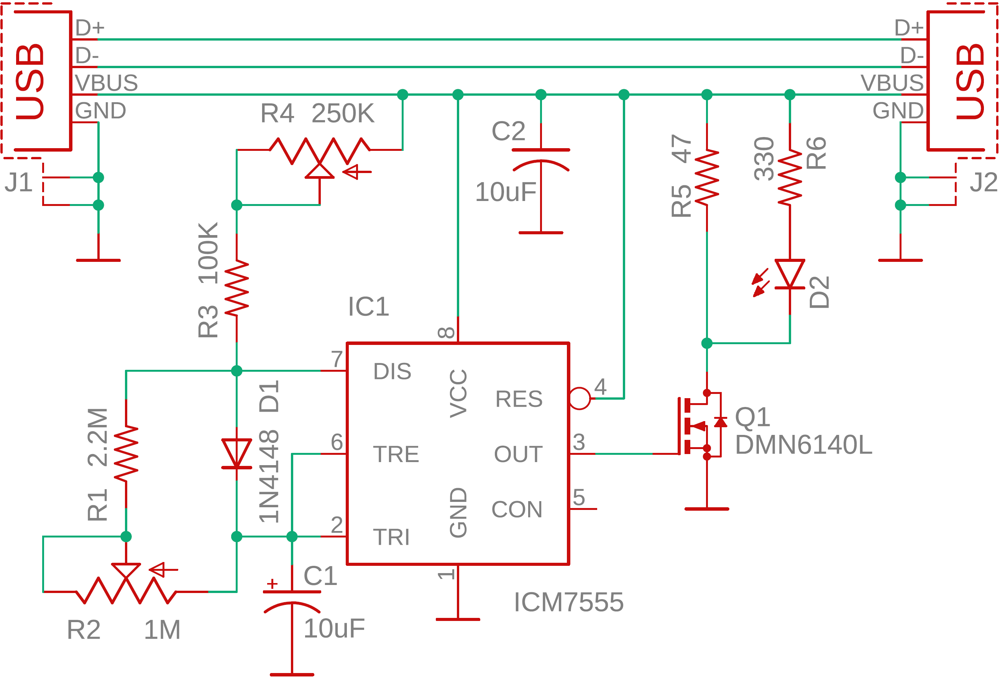

Power Bank Keep Alive
==========================================

Power banks often shut down when connected to low current devices as they designed to provide a power while charging a smartphone and to cut it off when the current drops below the threshold. This project started when I wanted to power up my smartfone acting as tethering device when camping. Eventually, smartphone battery died but charging from power bank didn’t kick off. The smartphone and power bank were paced on top of nearest pine tree to provide a better reception and it was a challenge every time remove it and charge. The next time my friend got a smartphone with weak battery and powering it from power bank didn’t help either as it disconnected the exact moment when smartphone charging completed and not resumed charging when smartphone battery was low. I have figured out that simulating a load through periodic current draw, around 100mA, shorter than the power bank’s shutdown interval, could prevent the power bank from powering turning off. The idea is not new, I have seen similar schematic posted on the Web in many places. The device is built around CMOS 555 timer to minimize the current draw by timer itself. The frequency and duty cycle adjusted using trim potentiometers to set to minimum power consumption but keep the power bank alive. The LED allows you to see the device activity. My original idea was to keep the duty cycle fixed and adjust only frequency but it didn’t work. Even more, some power banks seem to be checking for constant power consumption and simulating periodical loads not helping to trick them.

$${\color{blue}Printed \space circuit \space board \space layout \space is \space in \space Eagle \space 9 \space format.}$$

&nbsp;

